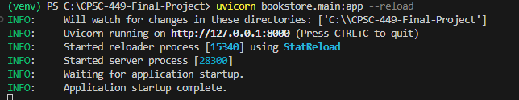
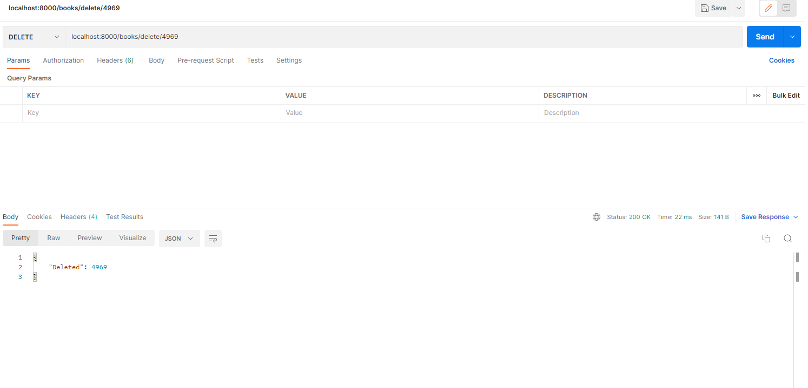
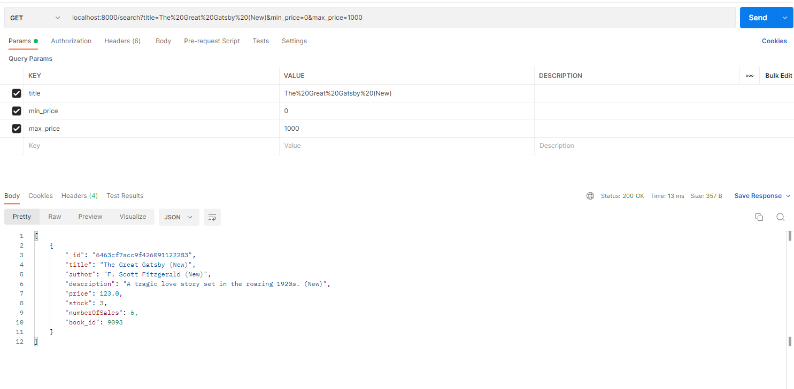
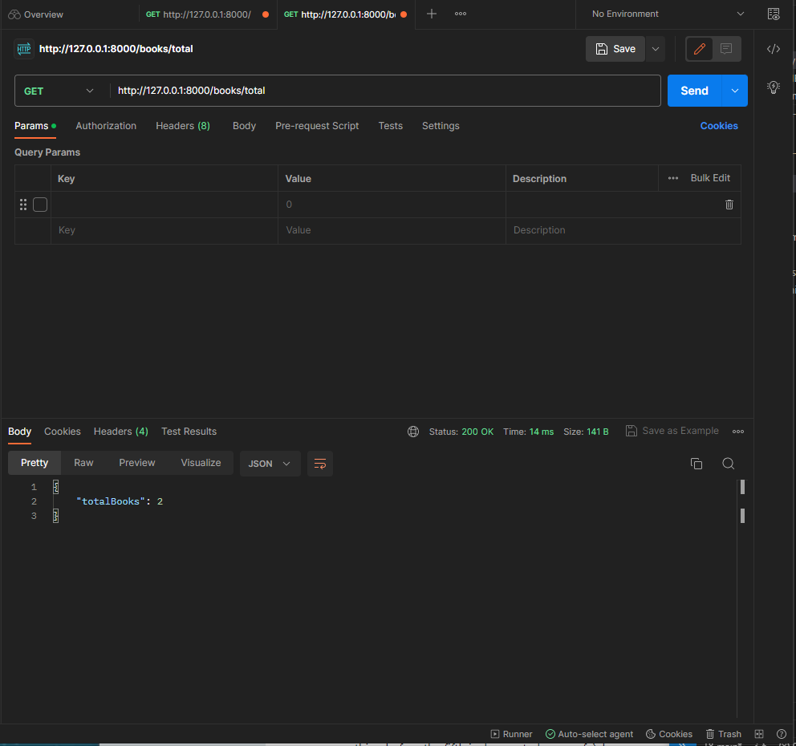
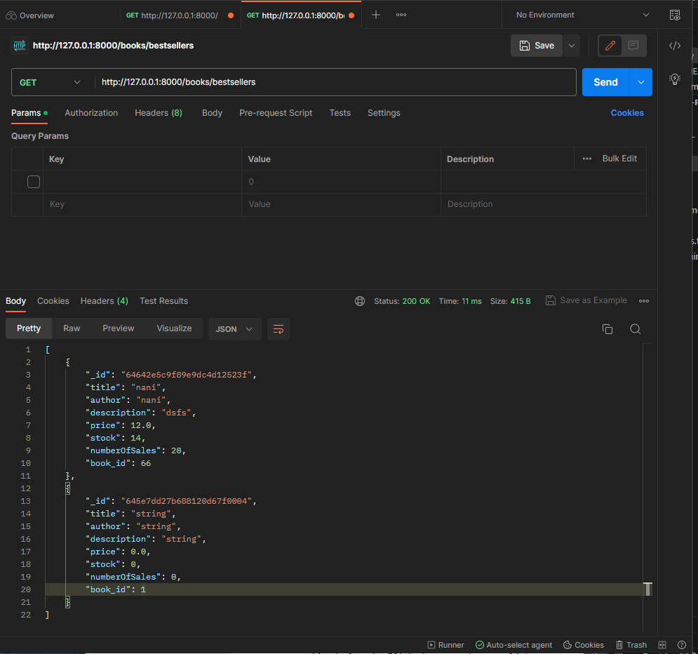
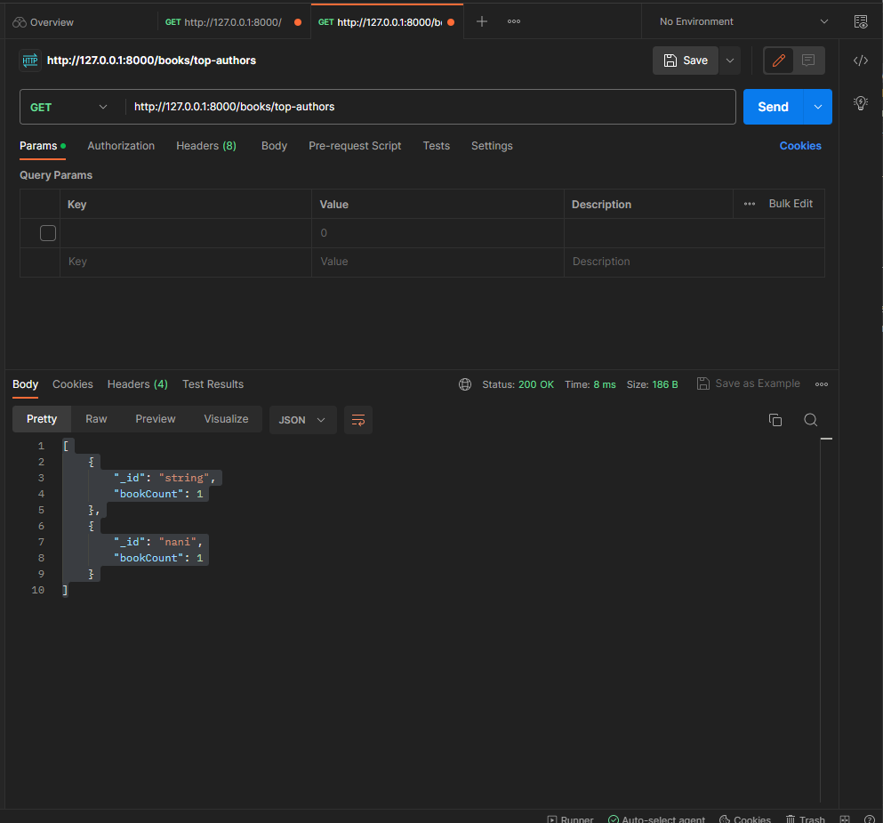
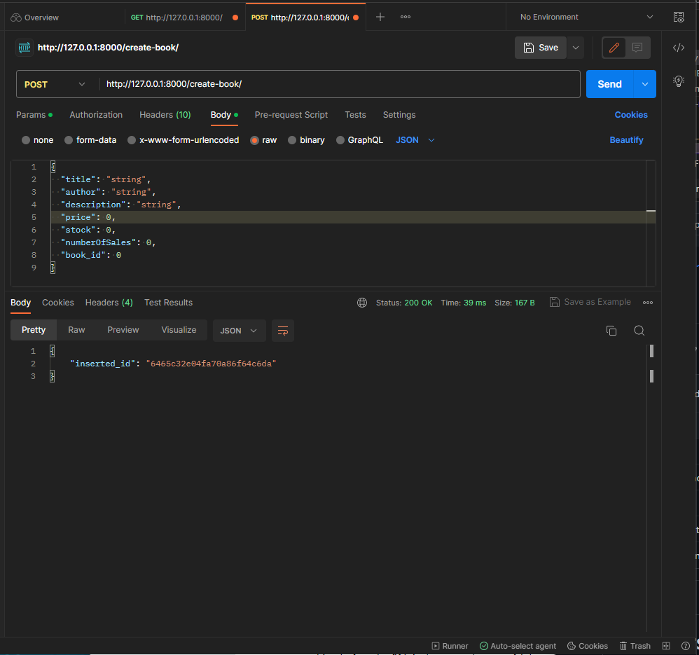

# Authors
* Matthew Butner

* Kim Eaton

* Pedro Morales

# Installation

* Create a Python Virtual Environment in the root directory.

```python -m venv myenv```

or

```python3 -m venv myenv```

* Activate the virtual environment
```
source myenv/bin/activate
```

* Install dependencies from requirements.txt
```
pip install -r requirements.txt
```

# MongoDB Prerequisites
* create a new database called "bookstore"
* Then, create a new collection called "books"


<p align = "center">

</p>
<p align = "center">
Database "bookstore" and collection "books" created with MongoDB Compass
</p>

# Run
Run using uvicorn 
```
uvicorn bookstore.main:app --reload
```
In the terminal, a hyperlink should appear. Hover over the http link and follow the link to view the application.
```
Uvicorn running on http://127.0.0.1:8000 (Press CTRL+C to quit)
```


## GET /books
### Postman 
1. Create a new HTTP request and set the method to GET.
2. Set the url to ```http://127.0.0.1:8000/books/```
3. Click the "Send" button.


### Response Body
* A list of books, or an empty list [] if the "books" collection doesn't contain any books. 
```
[
    {
        "title": "The cat in the hat",
        "author": "Dr. Seuss",
        "description": "A book about a cat in a hat",
        "price": 10.99,
        "stock": 10,
        "numberOfSales": 200,
        "book_id": 3492
    },
    {
        "title": "Misery",
        "author": "Stephen King",
        "description": "Misery is an American psychological horror thriller novel written by Stephen King.",
        "price": 7.98,
        "stock": 10,
        "numberOfSales": 124,
        "book_id": 1170
    }
]
```

## GET /books/{book_id}
### Postman
1. Create a new HTTP request and set the method to GET.
2. Set the URL to ```http://127.0.0.1:8000/books/{book_id}``` where {book_id} is the ID of the book to retrieve.
3. Click the "Send" button.


### Response Body
* A list containing a single retrieved book with ID {book_id}.
```
[
    {
            "title": "Misery",
            "author": "Stephen King",
            "description": "Misery is an American psychological horror thriller novel written by Stephen King.",
            "price": 7.98,
            "stock": 10,
            "numberOfSales": 124,
            "book_id": 1170
    }
]
```

* An empty list if the the book could not be retrieved (it doesn't exist).
```
[]
```

## PUT /books/{book_id}
### Postman
1. Create a new HTTP request and set the method to PUT.
2. Set the URL to ```http://127.0.0.1:8000/books/{book_id}``` where {book_id} is the ID of the book to update. 
3. To send a request body, click the "Body" tab, then select the "raw" option, then click on the dropdown menu and select "JSON"
4. Create a JSON object containing the fields you want to update for {book_id}. 
5. Click the "Send" button.


### Response Body
* An error message indicating that the requested book does not exist.
```
{
    "Error": "Book does not exist!"
}
```

* The number of book updates. A value of 1 indicates that the requested book has been updated, while a value of 0 means that no books were updated.
```
{
    "Modified": 1
}
```

## DELETE /books/delete/{book_id}
### Postman
1. Create a new HTTP request and set the method to DELETE.
2. Set the URL to ```http://127.0.0.1:8000/books/delete/{book_id}``` where {book_id} is the ID of the book to delete. 
3. Click the "Send" button.



### Response Body
* An error message indicating that the requested book does not exist.
```
{
    "Error": "Book not found!"
}
```

* If successful, you will get a message indicating deletion.
```
{
    "Deleted": {book_id}
}
```

## GET /search?title=<input_title>&min_price=<min_price>&max_price=<max_price>
### Postman
1. Create a new HTTP request and set the method to GET.
2. Set the URL to ```http://127.0.0.1:8000/search?title=<input_title>&min_price=<min_price>&max_price=<max_price>``` using title, minimum price, and maximum price for each respective parameter Use %20 to URL encode spaces in the title portion. 
3. EXAMPLE: localhost:8000/search?title=The%20Great%20Gatsby%20(New)&min_price=1&max_price=1000
4. Click the "Send" button.



### Response Body
* No books were found.
```
[]
```

* You will recieve a response encoded in JSON:
```
{
    {
        "_id": "6463cf7acc9f426091122283",
        "title": "The Great Gatsby (New)",
        "author": "F. Scott Fitzgerald (New)",
        "description": "A tragic love story set in the roaring 1920s. (New)",
        "price": 123.0,
        "stock": 3,
        "numberOfSales": 6,
        "book_id": 9093
    }
}
```

## GET /books/total The total number of books in the store
### POSTMAN
1.Create a new HTTP request and set the method to GET.
2. Set the url to ```http://127.0.0.1:8000/books/total```.
3. Click the "Send" button.



### Response Body
* You will recieve a response encoded in JSON:
```
{
    "totalBooks": 2
}
```

## The top 5 bestselling books
### POSTMAN
1. Create a new HTTP request and set the method to GET.
2. Set the url to ```http://127.0.0.1:8000/books/bestsellers```
3. Click the "Send" button.



### Response Body
* You will recieve a response encoded in JSON:
* A list of the top 5 bestselling books in the database
```
[
    {
        "_id": "64642e5c9f89e9dc4d12523f",
        "title": "nani",
        "author": "nani",
        "description": "dsfs",
        "price": 12.0,
        "stock": 14,
        "numberOfSales": 20,
        "book_id": 66
    },
    {
        "_id": "645e7dd27b688120d67f0004",
        "title": "string",
        "author": "string",
        "description": "string",
        "price": 0.0,
        "stock": 0,
        "numberOfSales": 0,
        "book_id": 1
    }
]
```
## The top 5 authors with the most books in the store
### POSTMAN
1. Create a new HTTP request and set the method to GET.
2. Set the url to ```http://127.0.0.1:8000/books/top-authors```
3. Click the "Send" button.



### Response Body
* You will recieve a response encoded in JSON:
* A list of the top 5 authors found in the database
 ```
 [
    {
        "_id": "string",
        "bookCount": 1
    },
    {
        "_id": "nani",
        "bookCount": 1
    }
]
```
## Create Book
### POSTMAN
1. Create a new HTTP request and set the method to POST.
2. Set the url to ```http://127.0.0.1:8000/create-book/```
3. Select body, select raw, select JSON.
4. Insert ```{
  "title": "string",
  "author": "string",
  "description": "string",
  "price": 0,
  "stock": 0,
  "numberOfSales": 0,
  "book_id": 0
} ```
Into JSON text box.
5. Click the "Send" button

### Response Body

* You will recieve a response encoded in JSON:
* Notification the book was inserted

```
{
    "inserted_id": "6465c32e04fa70a86f64c6da"
}
```
* An error message if book key already exists
```
{
    "error": "Duplicate key error!"
}
```
For further demonstrations, please watch the demo video. The application also has a few user-interfaces to help showcase each functionality.
